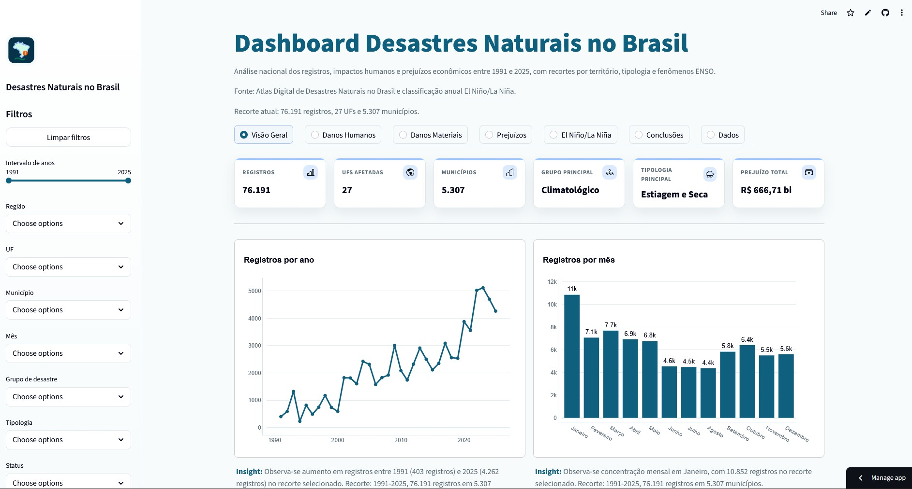
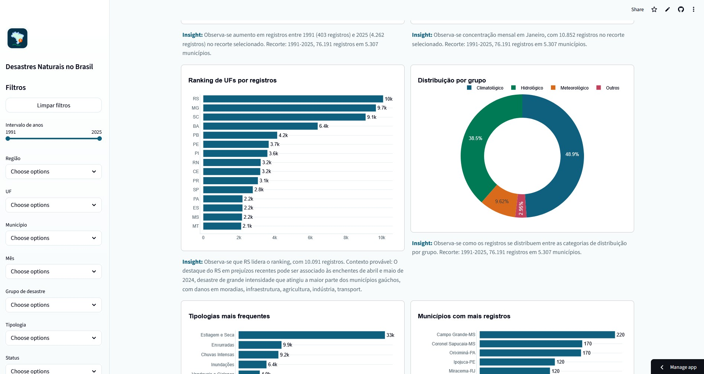
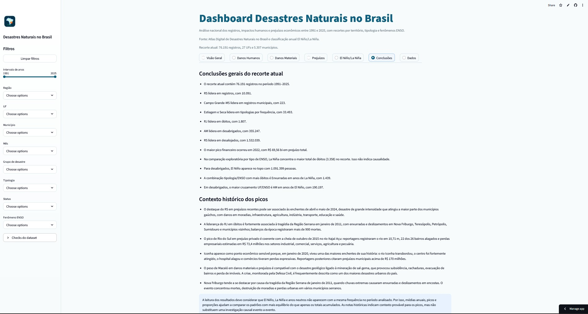

## Apresentação do projeto

Esse é um projeto acadêmico para a disciplina Linguagens de programação do curso Sistemas de Informação no Unilasalle RJ.<br>
Professor da disciplina: **Alexandre Louzada**<br>
Autor do dashboard e análises: **Aron Barbosa**<br>
Período: **2026.1**<br>


## Tema

Desastres naturais no Brasil

A fonte dos dados é real e de conhecimento nacional. Ela foi obtida pelo Atlas Digital de Desastres Naturais e pertence ao governo federal.

Créditos: https://atlasdigital.mdr.gov.br/


## Sobre a análise

Foi feito um dashboard interativo utilizando a biblioteca do Python Streamlit como interface de interação.

A análise conta com registros históricos de desastres naturais no Brasil entre 1991 e 2025. O projeto cruza dados do Atlas Digital de Desastres Naturais com uma classificação anual de El Niño/La Niña, permitindo explorar registros, impactos humanos, danos materiais, prejuízos econômicos e padrões associados ao ENSO.


## Preview do dashboard







## Principais Recursos

- Filtros por período, região, UF, município, mês, tipologia, status e fenômeno ENSO.
- KPIs gerais, humanos, materiais e econômicos.
- Gráficos interativos com Plotly.
- Cache do dataset processado em Parquet para acelerar a abertura do app.
- Insights automáticos abaixo dos gráficos, com fallback local e geração opcional via Gemini.
- Cache local de insights em JSON para reduzir chamadas de API.
- Contextos históricos curados para enriquecer a leitura dos principais picos.
- Seção de conclusões com achados do recorte selecionado.
- Tema claro customizado e landing page estática em `index.html`.

## Stack

- Python 3.12+
- Streamlit
- Pandas
- Plotly
- Pydantic AI com provider Google Gemini
- Ruff
- Taskipy
- Docker e Docker Compose

## Estrutura

```text
frontend/
  app.py                     # Entrada do dashboard Streamlit
  components/
    ai_insights.py           # Gemini, cache e fallback dos insights
    charts.py                # Fábricas de gráficos Plotly
    cleaning.py              # Limpeza dos dados
    constants.py             # Caminhos, paletas e mapas de colunas
    data_loader.py           # Leitura dos arquivos raw
    enso.py                  # Classificação ENSO
    filters.py               # Sidebar e filtros
    insights.py              # Insights locais/fallback
    metrics.py               # Agregações e KPIs
    sections.py              # Abas/seções do dashboard
    styles.py                # CSS global do Streamlit
data/
  raw/                       # Arquivos originais
  processed/                 # Parquet e cache de insights
  reference/                 # Contextos históricos curados
notebooks/
  analise-exploratorio.ipynb # Análise exploratória de apoio metodológico
assets/
  brand/                     # Ícone/favicons
  css/, js/, figma/          # Assets da landing page
  screenshots/               # Imagens do README
```

## Datasets tratados e otimizados via parquet


O Parquet acelera a abertura do dashboard e é recriado quando os arquivos raw são atualizados. O JSON guarda insights gerados para reaproveitamento quando o recorte e os dados do gráfico continuam compatíveis.

## Apresentação do projeto 🎬

<a href="https://aronbarbosag.github.io/analise-desastres-naturais-br/">Apresentação </a>

## Acesse o dashboard no endereço abaixo 📊

<a href="https://dashboard-desastres-naturais-br.streamlit.app/">Dashboard </a>


```


## Tasks

Os comandos recorrentes ficam centralizados no `pyproject.toml` via Taskipy.

| Comando | Descrição |
| --- | --- |
| `task start` | Inicia o dashboard em `localhost:8503`. |
| `task lint` | Executa o Ruff para verificar qualidade de código. |
| `task format` | Aplica correções automáticas e formatação com Ruff. |
| `task test` | Executa a suíte de testes, quando houver testes no projeto. |

Para consultar as tasks disponíveis:

```bash
task --list
```

## Gemini E Insights


A geração segue esta ordem:

1. Usa insight salvo em `data/processed/chart_insights.json`, quando o cache ainda é válido.
2. Tenta gerar insights em lote com Gemini, se as chaves estiverem configuradas.
3. Usa fallback local quando não há chave, a API retorna erro, ocorre `429` ou o limite de uso é atingido.

Os insights usam `data/reference/disaster_contexts.json` como curadoria auxiliar para explicar picos relevantes. Exemplos de contexto: enchentes no Rio Grande do Sul em 2024, tragédia da Região Serrana/RJ em 2011, cheia em Rio do Sul-SC, enchente em Iconha-ES e subsidência em Maceió-AL.

Essas notas devem ser lidas como contexto histórico provável, não como prova causal automática. Em cruzamentos ENSO, a leitura é exploratória e indica associação temporal, não causalidade.


## Landing Page

O arquivo `index.html` contém uma landing page estática para apresentação do projeto e link para o dashboard publicado.


## Metodologia E Limitações

- Os totais dependem dos filtros selecionados.
- Municípios são exibidos com UF para evitar ambiguidade.
- A classificação ENSO é anual; comparações indicam associação temporal exploratória, não causalidade.
- Valores monetários dependem da planilha de valores corrigidos do Atlas.
- Contextos históricos em `data/reference/disaster_contexts.json` enriquecem a interpretação, mas não substituem análise causal.
- A análise exploratória permanece em `notebooks/analise-exploratorio.ipynb` como material de apoio. O fluxo atual do app não depende de script para regenerar esse notebook.

## Fontes

- Atlas Digital de Desastres Naturais no Brasil: https://atlasdigital.mdr.gov.br/paginas/index.xhtml
- Atualização do Atlas Digital pelo MIDR: https://www.gov.br/mdr/pt-br/noticias/midr-atualiza-atlas-digital-de-desastres-com-dados-consolidados-ate-2025
